# Lole Restaurant OS — Corporate AI Organization

The full Lole corporate brain, modelled as an `agentcompanies/v1` package inspired by
Toast's enterprise restaurant technology organization.

---

## Complete Org Chart

```mermaid
graph TD
    %% ─── BOARD ───
    BOARD[🏛️ Board / Human Operators]

    %% ─── C-SUITE ───
    CEO[CEO - Chief Executive Officer]
    CTO[CTO - Chief Technology Officer]
    CPO[CPO - Chief Product Officer]
    CFO[CFO - Chief Financial Officer]
    CMO[CMO - Chief Marketing Officer]
    COO[COO - Chief Operating Officer]
    CSO[CSO - Chief Security Officer]

    BOARD --> CEO
    CEO --> CTO
    CEO --> CPO
    CEO --> CFO
    CEO --> CMO
    CEO --> COO
    CEO --> CSO

    %% ─── VP LAYER ───
    VPE[VP of Engineering]
    VPP[VP of Product]
    VPS[VP of Security & Risk]
    VPD[VP of Data & Analytics]
    VPG[VP of Growth & Revenue]
    VPF[VP of Finance]
    VPO[VP of Operations]
    VPCS[VP of Customer Success]

    CTO --> VPE
    CTO --> VPD
    CPO --> VPP
    CSO --> VPS
    CMO --> VPG
    CFO --> VPF
    COO --> VPO
    COO --> VPCS

    %% ─── ENGINEERING MANAGERS ───
    EMC[Eng. Manager - Core Runtime & Gateway]
    EMM[Eng. Manager - Mobile Native]
    EMP[Eng. Manager - Platform & DevOps]
    EMF[Eng. Manager - Frontend Architecture]
    DVL[DevOps Lead]

    VPE --> EMC
    VPE --> EMM
    VPE --> EMP
    VPE --> EMF
    EMP --> DVL

    %% ─── PRODUCT MANAGERS ───
    PMPOS[Product Manager - POS & Operations]
    PMM[Product Manager - Merchant Dashboard]

    VPP --> PMPOS
    VPP --> PMM

    %% ─── SECURITY & COMPLIANCE MANAGERS ───
    SM[Security Manager - SecOps]
    CM[Compliance Manager - ERCA & Privacy]
    DM[Data Manager - Analytics & Pipelines]

    VPS --> SM
    VPS --> CM
    VPD --> DM

    %% ─── 23 SPECIALIST DEPARTMENTS (as Boards) ───
    subgraph Engineering Departments
        D01[Core Runtime & Gateway]
        D02[Mobile Native & Fleet]
        D03[Sync & Persistence]
        D04[Frontend Architecture]
        D05[Backend Infrastructure]
        D06[Systems Design & Architecture]
        D07[AI Orchestration - COL]
        D08[Data Engineering]
    end

    subgraph Security & Compliance Departments
        D09[CyberSecurity SecOps]
        D10[Fiscal Compliance ERCA]
        D11[Data Privacy & Audit]
    end

    subgraph Product & UX Departments
        D12[POS & Operations UX]
        D13[Merchant Dashboard]
        D14[Guest Experience & Loyalty]
        D15[Content & Documentation]
    end

    subgraph Business Departments
        D16[Strategic Analytics]
        D17[Billing & Finance Tech]
        D18[Product Marketing]
        D19[Growth Engineering]
        D20[Customer Success Ops]
    end

    subgraph Operations Departments
        D21[Fleet & Device Management]
        D22[Delivery Aggregators]
        D23[DevOps & Site Reliability]
    end

    EMC --> D01
    EMM --> D02
    EMC --> D03
    EMF --> D04
    EMP --> D05
    CTO --> D06
    CEO --> D07
    VPD --> D08
    SM --> D09
    CM --> D10
    CM --> D11
    PMPOS --> D12
    PMM --> D13
    PMM --> D14
    VPP --> D15
    VPD --> D16
    VPF --> D17
    VPG --> D18
    VPG --> D19
    VPCS --> D20
    DVL --> D21
    VPO --> D22
    DVL --> D23
```



---

## Agent Roster

| Agent                        | Title                               | Reports To            |
| ---------------------------- | ----------------------------------- | --------------------- |
| CEO                          | Chief Executive Officer             | Board                 |
| CTO                          | Chief Technology Officer            | CEO                   |
| CPO                          | Chief Product Officer               | CEO                   |
| CFO                          | Chief Financial Officer             | CEO                   |
| CMO                          | Chief Marketing Officer             | CEO                   |
| COO                          | Chief Operating Officer             | CEO                   |
| CSO                          | Chief Security Officer              | CEO                   |
| VP of Engineering            | Vice President of Engineering       | CTO                   |
| VP of Product                | Vice President of Product           | CPO                   |
| VP of Security               | VP Security & Risk                  | CSO                   |
| VP of Data                   | VP Data & Analytics                 | CTO                   |
| VP of Growth                 | VP Growth & Revenue                 | CMO                   |
| VP of Finance                | Vice President of Finance           | CFO                   |
| VP of Operations             | Vice President of Operations        | COO                   |
| VP of Customer Success       | VP Customer Success                 | COO                   |
| Engineering Manager Core     | Eng. Manager, Core Runtime          | VP Engineering        |
| Engineering Manager Mobile   | Eng. Manager, Mobile Native         | VP Engineering        |
| Engineering Manager Platform | Eng. Manager, Platform & DevOps     | VP Engineering        |
| Engineering Manager Frontend | Eng. Manager, Frontend Architecture | VP Engineering        |
| Product Manager POS          | PM, POS & Restaurant Ops            | VP Product            |
| Product Manager Merchant     | PM, Merchant Dashboard              | VP Product            |
| Security Manager             | Security Manager, SecOps            | VP Security           |
| Compliance Manager           | Compliance Manager, ERCA            | VP Security           |
| Data Manager                 | Data Manager, Analytics             | VP Data               |
| DevOps Lead                  | DevOps Lead                         | Eng. Manager Platform |

---

## How Work Flows

**Pattern: Hierarchical Pipeline with Holacratic Execution**

1. **Board → CEO**: Strategic mandates via `/.col/memory/directives/`
2. **CEO → C-Suite**: C-Suite Directives dispatched to VPs
3. **VPs → Managers**: Sprint assignments and feature mandates
4. **Managers → Departments**: Granular task execution via heartbeat
5. **Departments → Managers → VPs → CEO**: Blocker escalation via `blockedByIssueIds`

**The Golden Rule:** NEVER ask a human to do what an agent could do.

---

## Getting Started

This company package is designed for use with [Paperclip](https://github.com/paperclipai/paperclip)
and is compatible with the [Agent Companies specification](https://agentcompanies.io/specification).

To import into Paperclip:

```bash
paperclipai company import --from .col/company/
```
